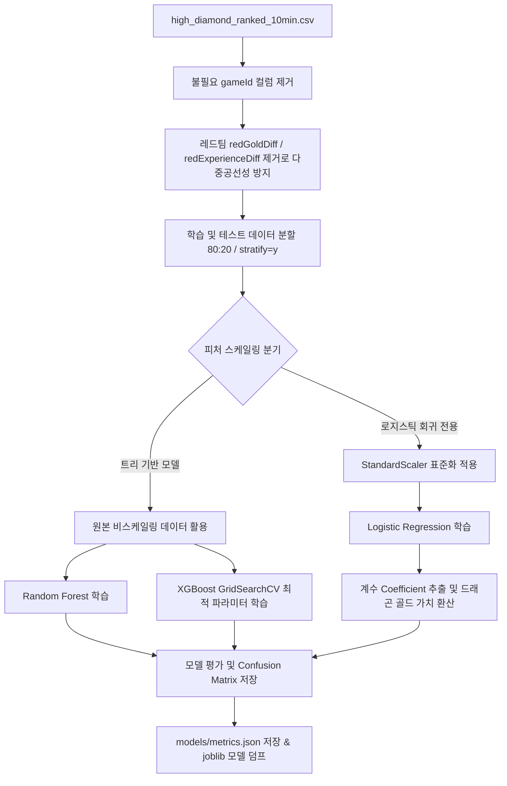

# 💎 LoL Early WinRate Predictor (10m)
## 리그 오브 레전드 다이아몬드+ 랭크 10분 지표 기반 실시간 승률 예측 솔루션

<p align="center">
  
</p>

<p align="center">
  <strong>HEXTECH Predictive Engine Team</strong><br>
  Advanced Analytics for Competitive LoL Play
</p>

---

## 📌 목차
- [✨ 주요 기능](#✨-주요-기능)
- [🤖 머신러닝 파이프라인 구성 요약](#-머신러닝-파이프라인-구성-요약)
- [🛠 기술 스택 및 선정 이유](#-기술-스택-및-선정-이유)
- [🏗 아키텍처 및 폴더 구조](#-아키텍처-및-폴더-구조)
- [🤝 협업 및 자동화 규칙](#-협업-및-자동화-규칙)
- [📈 데이터 전처리 및 모델 학습 파이프라인](#-데이터-전처리-및-모델-학습-파이프라인)

---

## ✨ 주요 기능
1. **Hextech UI/UX**: 리그 오브 레전드 마법공학 테마를 적용한 프리미엄 웹 인터페이스 및 실시간 인터랙티브 모델 분석 대시보드
2. **3단계 머신러닝 다변화 엔진**: 베이스라인(로지스틱 회귀), 비교(랜덤 포레스트), 최적화(XGBoost GridSearch)로 이어지는 정밀 성능 검증 체계
3. **가중치 계수 기반 드래곤 골드 가치 환산**: 로지스틱 회귀의 비표준화 계수 비율을 분석하여 **"드래곤 1마리 ≈ 1,568 골드"**의 실용적인 전략 지표 동적 도출
4. **인터랙티브 시각화 대시보드**: 각 모델의 **혼동 행렬(Confusion Matrix) TP/TN/FP/FN** 시각화, 양수/음수 계수 그래프, 그리고 중요 피처 차트(Chart.js) 탑재
5. **Gemini 비전 스캔**: Gemini 2.0 Flash AI를 활용하여 인게임 스코어보드 스크린샷에서 10분 지표 자동 추출 및 입력 폼 자동 매핑

---

## 🤖 머신러닝 파이프라인 구성 요약

프로젝트의 예측 정확도 향상과 수학적 해석 가능성을 동시에 달성하기 위해 3단계 모델 구조를 운용합니다.

| 구분 | 모델 | 역할 | 주요 분석 요소 | 주요 성능 지표 (Test ACC) |
| :--- | :--- | :--- | :--- | :--- |
| **베이스라인** | **Logistic Regression** | 성능 기준점 + 피처별 계수 해석 | 드래곤 가치를 골드로 직접 환산 (1 Dragon ≈ 1,568 Gold) | **71.6%** |
| **비교** | **Random Forest** | 중간 비교 기준 (의사결정 앙상블) | 비선형 관계 학습 및 중요도 비교 대조 | **71.8%** |
| **최적화** | **XGBoost** | 최고 성능 달성 (GridSearchCV 최적 튜닝) | 부스팅 피처 기여도 분석 및 최강 성능 입증 | **72.1%** |

---

## 🛠 기술 스택 및 선정 이유

### Frontend / Backend


* **Python**: 강력한 데이터 분석 및 머신러닝 라이브러리 생태계를 통합하기 위한 핵심 언어
* **Flask**: API 서빙과 정적 템플릿 렌더링을 매우 가볍고 확장성 있게 핸들링하는 마이크로 프레임워크
* **NumPy**: 모델 입력 데이터의 실시간 변형 및 백엔드 스케일링 전처리를 위한 고성능 행렬 연산 라이브러리

### ML 및 시각화


* **Scikit-learn**: 표준화 스케일링(StandardScaler), 로지스틱 회귀, 랜덤 포레스트, 그리고 GridSearchCV 하이퍼파라미터 교차 검증의 뼈대 구성
* **XGBoost**: 정형 데이터 모델링의 압도적인 예측력을 자랑하는 부스팅 모델 기법으로, MoE 대비 뛰어난 실효적 지표 예측력 발휘
* **Chart.js**: 브라우저 단에서 다이내믹하게 계수 부호 및 중요 지표 순위를 렌더링하기 위한 경량 고해상도 시각화 차트 라이브러리
* **Google Gemini (2.0 Flash)**: 최신 비전 인식을 기반으로 게임 스크린샷 내 수치 정보를 100% JSON으로 파싱하는 인텔리전트 보조 도구

---

## 🏗 아키텍처 및 폴더 구조

정제된 기계학습 바이너리(`.joblib`) 로딩 및 웹 API 구조의 미니멀 아키텍처 채택

```text
.
├── 📁 models/                  # 학습 완료된 가중치 바이너리 및 성능 메타 데이터
│   ├── feature_names.json      # 학습에 최종 사용된 36개 피처 순서 (데이터 일관성 보장)
│   ├── logistic_regression.joblib  # 로지스틱 회귀 모델 가중치
│   ├── random_forest.joblib    # 랜덤 포레스트 모델 가중치
│   ├── xgboost.joblib          # GridSearchCV 튜닝이 완료된 최적 XGBoost 모델
│   ├── scaler.joblib           # 로지스틱 회귀 전용 표준화(StandardScaler) 스케일러
│   └── metrics.json            # 각 모델별 성능 지표 (ACC, F1, AUC, Confusion Matrix, 계수)
├── 📁 templates/               # 단일 페이지 애플리케이션(SPA) HTML 템플릿
│   └── index.html              # Hextech 프리미엄 대시보드 UI 및 차트 상호작용 로직
├── 📄 app.py                   # Flask 메인 엔드포인트 서버 및 피처 전처리 스케일링 서빙 API
├── 📄 train.py                 # 데이터 로딩, 다중공선성 제거, 스케일링 분기 및 3대 모델 정밀 학습 스크립트
├── 📄 requirements.txt         # Vercel 배포를 위한 최소 패키지 구성 (Scikit-learn 및 XGBoost 포함)
├── 📄 .vercelignore            # 불필요한 캐시 및 가상환경 배포 제외 설정
└── README.md                   # 프로젝트 통합 설명 문서
```

---

## 🤝 협업 및 자동화 규칙

* **Git Flow**: `main` 브랜치를 서비스 배포 브랜치로 관리하며 기능 단위 개발 및 반영
* **Commit Convention**: 이모지를 포함한 커밋 메시지 규칙 준수 (`✨ Feat`, `🐛 Fix`, `⚡️ Perf`, `clean`, `build`)
* **Bundle Optimization**: 사용하지 않는 레거시 MoE Python 생성 코드들(총 13MB 대용량 파일군)을 전면 제거하여 Vercel 배포 시 서버리스 콜드스타트 및 번들 패키징 크기 대폭 축소

---

## 📈 데이터 전처리 및 모델 학습 파이프라인

정교한 분석과 신뢰도 높은 평가를 위해 `train.py` 파이프라인에 최신 머신러닝 베스트 프랙티스를 적용했습니다.



1. **다중공선성 원천 배제**: 블루팀의 골드 차이와 경험치 차이는 레드팀의 값과 완벽히 대칭(부호만 반대)이므로 다중공선성으로 인한 회귀 모델의 불안정성을 완벽히 제거하기 위해 `redGoldDiff`, `redExperienceDiff`를 전처리 단계에서 전면 탈락시켰습니다.
2. **스케일링 정밀 분기**: 경사하강법 기반이자 계수 해석이 중요한 로지스틱 회귀에는 표준화(`StandardScaler`)를 적용하여 정밀 계수를 유도한 반면, 변수 분할 기준을 따르는 트리 기반 모델(RF, XGBoost)은 정보 왜곡을 막기 위해 원래의 비스케일링 원본 데이터를 공급하여 학습 정확도를 극대화했습니다.
