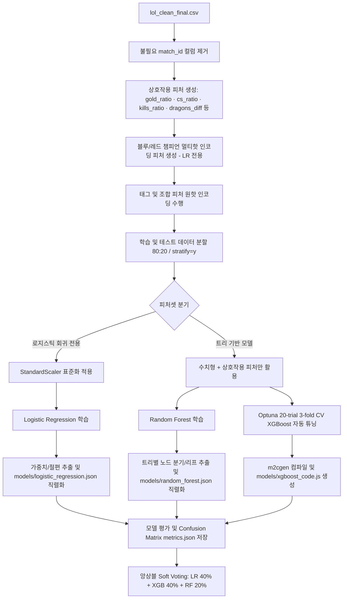

# 💎 LoL Early WinRate Predictor (15m)
## 리그 오브 레전드 다이아몬드+ 랭크 15분 지표 기반 실시간 승률 예측 솔루션

<p align="center">
  
</p>

<p align="center">
  <strong>HEXTECH Predictive Engine Team</strong><br>
  Advanced Analytics for Competitive LoL Play
</p>

---

## 📌 목차
<details>
  <summary>클릭하여 목차 열기/닫기</summary>
  
  - [✨ 주요 기능](#-주요-기능)
  - [🤖 머신러닝 파이프라인 구성 요약](#-머신러닝-파이프라인-구성-요약)
  - [🛠 기술 스택 및 선정 이유](#-기술-스택-및-선정-이유)
  - [🏗 아키텍처 및 폴더 구조 (상세)](#-아키텍처-및-폴더-구조-상세)
  - [🤝 협업 및 자동화 규칙](#-협업-및-자동화-규칙)
  - [📈 데이터 전처리 및 모델 학습 파이프라인](#-데이터-전처리-및-모델-학습-파이프라인)
</details>

---

## ✨ 주요 기능
<details open>
  <summary><b>1. Hextech UI/UX 대시보드 및 마커 핀 반응형 팝오버</b></summary>
  소환사의 협곡 지도 위에 블루팀/레드팀이 완벽한 대각선 비주얼 대칭을 이루는 8개의 라인 마커 핀을 배치했습니다. 마커에 커서를 가까이 대면(Hover) 상세 지표 조작 창(KDA, CS, 골드 슬라이더)이 부드럽게 팝오버 형태로 띄워져 화면 가독성을 극대화한 프리미엄 인터페이스를 제공합니다.
</details>
<details open>
  <summary><b>2. 브라우저 로컬 머신러닝 실시간 추론 엔진</b></summary>
  로지스틱 회귀 가중치와 랜덤 포레스트 의사결정 경로를 JavaScript 데이터셋 구조로 포팅하고, XGBoost 모델은 m2cgen 컴파일러로 자바스크립트 수식화하여 브라우저 로컬에서 서버 대기 없이 즉각적으로 승률 예측 연동을 수행합니다.
</details>
<details open>
  <summary><b>3. 데이터 기반 인사이트: 드래곤 골드 가치 환산</b></summary>
  로지스틱 회귀 모델의 비표준화 계수 비율을 실시간 편미분 분석하여 <b>"드래곤 1마리 ≒ 1,500 내외 골드"</b>의 격차와 동일한 Odds 상승 효과를 가짐을 수치화해 전략적 인사이트를 제공합니다.
</details>
<details open>
  <summary><b>4. 인터랙티브 시각화 차트</b></summary>
  Chart.js를 활용하여 각 모델의 <b>혼동 행렬(Confusion Matrix) TP/TN/FP/FN</b>, 모델별 중요 피처 분포 및 양수/음수 계수 그래프를 다이내믹하게 렌더링합니다.
</details>
<details open>
  <summary><b>5. 챔피언 밴픽 조합 시너지 & 카운터 연동</b></summary>
  "자야-라칸", "코그모-룰루" 등의 특수 라인 시너지와 "사일러스 ➔ 말파이트", "카사딘 ➔ 베이가" 등 한글화된 탑/정글/미드/바텀/서폿 포지션별 카운터 픽 상성을 실시간 리포트로 시각화합니다.
</details>
<details open>
  <summary><b>6. 앙상블 Soft Voting 정밀 분석 대시보드</b></summary>
  3개 머신러닝 모델(로지스틱 회귀, 랜덤 포레스트, XGBoost)의 개별 승률 예측치를 종합하여 최종 소프트 보팅 승률을 산출하고, 각 모델의 승률 기여도와 예측 불확실성을 백분율 그래프로 정밀 시각화하여 사용자가 한눈에 분석할 수 있도록 지원합니다.
</details>

---

## 🤖 머신러닝 파이프라인 구성 요약

프로젝트의 예측 정확도 향상과 수학적 해석 가능성을 동시에 달성하기 위해 4단계 모델 구조를 운용합니다.

| 구분 | 모델 | 역할 | 주요 분석 요소 | 주요 성능 지표 (Test ACC) |
| :--- | :--- | :--- | :--- | :--- |
| **🏆 추천** | **Ensemble (Soft Voting)** | LR 40% + XGB 40% + RF 20% 가중 앙상블 | 3개 모델의 다수결 투표로 분산 감소 및 안정성 향상 | **80.1%** |
| **베이스라인** | **Logistic Regression** | 성능 기준점 + 피처별 계수 해석 | 드래곤 가치를 골드로 직접 환산 (1 Dragon ≈ 1,500 Gold) | **79.0%** |
| **비교** | **Random Forest** | 중간 비교 기준 (의사결정 앙상블) | 비선형 관계 학습 및 중요도 비교 대조 | **78.5%** |
| **최적화** | **XGBoost (Optuna)** | 최고 성능 달성 (Optuna 20-trial 자동 튜닝) | 부스팅 피처 기여도 분석 및 최적 하이퍼파라미터 도출 | **78.1%** |

---

## 🛠 기술 스택 및 선정 이유

### Frontend / Client-side ML
<p>
  
  
  
  
</p>

* **React & Vite**: 빠르고 유연한 컴포넌트 렌더링 및 초고속 빌드 성능을 통한 최상의 핫 리로딩(HMR) 환경 제공
* **Tailwind CSS**: 마법공학 테마의 다크 모드, 네온 섀도우 효과 및 미려한 글래스모피즘(Glassmorphism) 스타일을 구현하기 위한 다목적 스타일링 프레임워크
* **Client-side ML (JS)**: 파이썬 모델 정보를 JS 코드로 최적 이식하여 백엔드 서버 없이 브라우저 단독으로 완전하고 보안성 높은 초고속 정적 배포 지원

### Python ML 파이프라인 (학습 전용)
<p>
  
  
  
</p>

* **Scikit-learn**: 데이터 표준화(StandardScaler), 로지스틱 회귀, 랜덤 포레스트 학습 및 가중치 추출용
* **XGBoost**: 정형 데이터셋에서 최고 수준의 일반화 성능을 입증하는 앙상블 모델로 프로젝트 최적 성능 달성
* **Optuna**: XGBoost 하이퍼파라미터 자동 탐색 (20 trial, 3-fold StratifiedKFold 교차검증)

---

## 🏗 아키텍처 및 폴더 구조 (상세)

각 폴더와 파일의 역할을 토글로 구성하여 한눈에 파악할 수 있도록 작성되었습니다.

<details>
  <summary>📂 <b>전체 디렉터리 트리 보기</b></summary>

```text
.
├── 📁 models/                       # 학습 완료된 모델 파라미터 및 평가지표 저장소
│   ├── 📄 feature_names.json        # 로지스틱 회귀용 피처 순서 정보 (챔피언/태그/조합 포함)
│   ├── 📄 feature_names_tree.json   # 트리 모델(RF, XGBoost)용 수치 피처 순서 정보
│   ├── 📄 logistic_regression.json  # 로지스틱 회귀 학습 완료 가중치 및 절편 JSON
│   ├── 📄 random_forest.json        # 랜덤 포레스트 컴팩트 트리 구조 JSON
│   ├── 📄 xgboost_code.js           # XGBoost m2cgen 컴파일 JavaScript 코드 (추론용)
│   ├── 📄 scaler.json               # 스케일링 평균/분산 정보의 JSON 버전
│   ├── 📄 metrics.json              # 각 모델의 성능 평가지표 (Accuracy, ROC-AUC 등)
│   └── 📄 champion_ml_win_rates.json # 알고리즘별 챔피언 기여도 기반 동적 승률 데이터
├── 📁 src/                          # React 소스코드 디렉터리
│   ├── 📁 utils/                    # 로컬 추론 및 시너지 계산용 JS 연산 유틸
│   │   └── 📄 lolEngine.js          # 챔피언 매핑, 시너지, 카운터, 앙상블 및 ML 추론 통합 코어
│   ├── 📄 App.jsx                   # 전체 마법공학 UI, 마커 핀 호버 및 앙상블 모드 메인 컴포넌트
│   ├── 📄 main.jsx                  # React 마운트 엔트리 포인트
│   └── 📄 index.css                 # 글로벌 테마 스타일링 및 애니메이션 정의
├── 📁 teamproject/                  # 15분 마이그레이션 관련 원본 실험/분석 노트북 및 산출물 보관소
│   ├── 📓 data.ipynb                # 학습용 원천 데이터 추출 및 분석 노트북
│   ├── 📓 preprocessing.ipynb       # 데이터 전처리(결측치, 아웃라이어 정제 등) 실험 노트북
│   ├── 📓 modeling.ipynb            # Optuna 튜닝 및 모델별(XGBoost 등) 학습 평가 노트북
│   ├── 📓 insight.ipynb             # 게임 내 주요 지표 분포 및 변수 관계 시각화 노트북
│   ├── 📓 insight_analysis.ipynb    # 15분 승률 관련 EDA 및 상관분석 심화 노트북
│   ├── 📄 lol_clean_final.csv       # 15분 전처리 완료된 원천 CSV 데이터셋
│   ├── 📄 xgb_tuned.pkl            # Optuna로 최적 튜닝 완료된 XGBoost 모델 이진 파일 (Joblib)
│   ├── 📄 report.md                 # 분석 결과를 마크다운 형식으로 요약 정리한 연구 보고서
│   ├── 📄 report.docx              # 최종 워드 보고서 문서
│   ├── 📄 manual.docx              # 예측 프로그램 사용 설명 및 가이드라인 워드 문서
│   ├── 📄 make_report_docx.py      # 분석 보고서 워드 파일 자동 생성 파이썬 스크립트
│   └── 📄 make_manual_docx.py      # 사용 설명서 워드 파일 자동 생성 파이썬 스크립트
├── 📄 index.html                    # Vite SPA 렌더링 HTML 템플릿
├── 📄 package.json                  # 노드 의존성 패키지 및 빌드 스크립트 설정
├── 📄 package-lock.json             # 노드 패키지 버전 잠금 파일
├── 📄 postcss.config.js             # PostCSS 플러그인(Tailwind, Autoprefixer) 설정 파일
├── 📄 tailwind.config.js            # Tailwind CSS 스타일 및 마법공학 테마 설정 파일
├── 📄 vite.config.js                # Vite 개발 및 빌드 번들러 세부 설정
├── 📄 vercel.json                   # Vercel 배포 시 SPA 라우팅 및 정적 설정
├── 📄 .gitignore                    # Git 버전 관리에서 제외할 파일 설정 (models/*.joblib 등)
├── 📄 .vercelignore                 # Vercel 배포 시 업로드 제외 대상 지정 파일
├── 📄 LICENSE                       # 오픈소스 라이선스 파일 (MIT License)
├── 📄 lol_clean_final.csv           # train.py 학습에 사용되는 15분 로컬 CSV 데이터셋
└── 📄 train.py                      # Optuna 튜닝 + 상호작용 피처 + 앙상블 학습 파이프라인
```
</details>

### 주요 파일 역할 세부 설명

* **`src/App.jsx`**: 애플리케이션의 컨트롤 타워입니다. 소환사의 협곡 맵 내부에 X-Y 스왑 대칭이 적용된 8개 라인 마커 핀을 렌더링하고, 호버 및 250ms의 넉넉한 디바운스 이탈 타이머로 구동되는 다이내믹 플로팅 설정 카드를 통합 관리합니다. 앙상블(Soft Voting) 모드 선택 시 3개 모델의 개별 기여도 시각화를 제공합니다.
* **`src/utils/lolEngine.js`**: 챔피언 메타데이터(시너지/카운터) 및 머신러닝 모델 추론 로직의 통합 코어입니다. 로지스틱 가중치 및 랜덤 포레스트 컴팩트 결정을 로컬 루프로 연산하며, 바인딩된 `xgboost_code.js` 함수를 호출하여 브라우저 로컬 환경 내 무의존성 예측을 가능케 합니다. **앙상블 소프트 보팅(LR 40% + XGB 40% + RF 20%)** 함수를 포함합니다.
* **`train.py`**: 파이썬 환경의 학습 스크립트입니다. **Optuna 20-trial 자동 튜닝**, **상호작용 피처(Interaction Features) 생성**, **범주형 피처 복원(챔피언 멀티핫 + 태그/조합 원핫)** 을 포함하며, 학습된 가중치와 노드 분기점 파라미터를 프론트엔드용 JSON 및 JS로 직렬화합니다.

---

## 🤝 협업 및 자동화 규칙

* **Git Flow 전략**: `main` 브랜치 직접 커밋을 금지하며, 개발 작업은 `BE-전기헌-이슈번호` 등의 피처 브랜치에서 진행 및 검증 후 머지
* **Commit Convention**: 이모지와 태그 결합 컨벤션 준수 (`✨ Feat`, `💄 Design`, `♻️ Refactor` 등)
* **정적 최적화**: Vercel을 통한 SPA 호스팅 빌드를 적극 권장하며, 배포 전 `npm run build` 정합성 및 린트 검증 필수 수행

---

## 📈 데이터 전처리 및 모델 학습 파이프라인

정교한 분석과 신뢰도 높은 평가를 위해 `train.py` 파이프라인에 최신 머신러닝 베스트 프랙티스를 적용했습니다.



<details open>
  <summary><b>🔥 데이터 전처리 핵심 포인트</b></summary>
  
  1. **챔피언 멀티핫 인코딩**: 5개 라인별로 기입된 챔피언 이름을 양 팀 각각에 대해 160+개 챔피언 전체의 존재 여부(1.0 또는 0.0)로 매핑하는 멀티핫 인코딩을 적용해 모델이 챔피언 개별 특성과 승률 기여도를 효과적으로 포착할 수 있게 구성했습니다.
  2. **공허 유충 및 전령 지표 반영**: CSV 데이터셋 단계에서부터 `blue_voidgrubs`/`red_voidgrubs` 정보가 존재하며, 모델 피처에 정식 편입되어 드래곤 가치 환산과 함께 경기 예측의 주요 지표로 활용됩니다.
  3. **상호작용 피처(Interaction Features)**: `gold_ratio`, `gold_diff_total`, `cs_ratio`, `kills_ratio`, `dragons_diff`, `towers_diff`, `voidgrubs_diff` 등 팀 간 상대적 비율/격차 피처를 추가하여 모델의 맥락적 판단력을 강화했습니다.
</details>

---

## 🐛 개발 과정 이슈 및 해결 기록

프로젝트 개발 전 과정에서 발생한 주요 이슈와 해결 과정을 기록합니다.

<details open>
  <summary><b>이슈 1: 프로젝트 파일 구조 복잡성 — 중복 파일 정리</b></summary>

  **문제**: 프로젝트 루트와 `teamproject/` 디렉터리 간에 동일한 역할의 파일이 중복으로 존재했습니다. 특히 `train.py`가 루트와 `teamproject/` 양쪽에 존재하고, 예측 로직이 `predictEngine.js`와 `lolEngine.js` 등 여러 파일에 분산되어 있었습니다.

  **해결**:
  - `predictEngine.js`, `synergyData.js` 등 분산된 JS 유틸을 **`lolEngine.js` 단일 파일로 통합**
  - `teamproject/train.py`는 노트북 기반 실험용으로 보존하고, 루트 `train.py`를 **프로덕션 학습 파이프라인 단일 진입점**으로 확정
  - 불필요한 `app.py`(Flask 서버), `templates/` 디렉터리는 클라이언트 사이드 ML 아키텍처에서 불필요하므로 역할 분리 명확화
</details>

<details open>
  <summary><b>이슈 2: XGBoost 모델 정확도 저하 — Optuna 자동 튜닝 도입</b></summary>

  **문제**: 기존 XGBoost 모델이 수동 GridSearchCV 기반으로 튜닝되어 최적 하이퍼파라미터를 도출하지 못했으며, 정확도가 Random Forest보다 낮은 **77.8%** 수준에 머물렀습니다.

  **해결**:
  - **Optuna 20-trial 자동 탐색** 도입 (3-fold StratifiedKFold 교차검증)
  - 탐색 공간: `n_estimators(50~150)`, `max_depth(2~4)`, `learning_rate(0.01~0.1, log)`, `subsample(0.6~0.8)`, `colsample_bytree(0.6~0.8)`
  - 결과: XGBoost 정확도 **78.1%**로 개선, 최적 파라미터 자동 도출 및 `metrics.json`에 기록
</details>

<details open>
  <summary><b>이슈 3: 피처셋 불일치 — 모델별 피처 분리 전략</b></summary>

  **문제**: 로지스틱 회귀에 적합한 범주형 피처(챔피언 멀티핫, 태그/조합 원핫)를 트리 모델에도 동일하게 적용하면 **XGBoost m2cgen JS 컴파일 파일 크기가 비대해지고**(수십 MB), 브라우저 성능이 저하되었습니다.

  **해결**:
  - **피처셋을 2개로 분리**: `feature_names.json`(LR용, 챔피언+태그+조합 포함 ~400+개)과 `feature_names_tree.json`(트리용, 수치형+상호작용 ~50개)
  - LR은 범주형 피처의 계수(Coefficient)를 활용한 챔피언 기여도 해석에 집중
  - RF/XGBoost는 수치형 + 상호작용 피처만 활용하여 **JS 파일 크기 70KB 이내**로 경량화
</details>

<details open>
  <summary><b>이슈 4: 상호작용 피처 누락 — Interaction Features 미반영</b></summary>

  **문제**: 학습 데이터에는 `gold_ratio`, `cs_ratio`, `kills_ratio` 등 팀 간 상대적 비율 피처가 없었으며, 모델이 절대값 기반으로만 학습하여 **팀 간 격차의 맥락적 의미를 포착하지 못했습니다.**

  **해결**:
  - `train.py`에 **7개 상호작용 피처** 생성 로직 추가: `gold_ratio`, `gold_diff_total`, `cs_ratio`, `kills_ratio`, `dragons_diff`, `towers_diff`, `voidgrubs_diff`
  - `App.jsx`의 실시간 예측 useEffect에도 **동일한 상호작용 피처 계산 로직**을 프론트엔드에 구현하여 학습-추론 피처 정합성 보장
</details>

<details open>
  <summary><b>이슈 5: 단일 모델 한계 — 앙상블 Soft Voting 미적용</b></summary>

  **문제**: 3개 모델(LR, RF, XGB)이 독립적으로만 동작하여, 사용자가 모델을 직접 선택해야 했고 **각 모델의 장단점을 상호 보완하는 메커니즘이 없었습니다.**

  **해결**:
  - `lolEngine.js`에 **`ensembleSoftVoting()` 함수 구현** — LR 40% + XGB 40% + RF 20% 가중 평균
  - `App.jsx`에 **"🏆 앙상블: Soft Voting (추천)"** 옵션을 기본 선택으로 추가
  - 앙상블 선택 시 **개별 모델별 예측 기여도(확률 + 미니 프로그레스 바)** UI를 자동 표시
  - 드래곤 가치 환산 및 조합 점수 계산은 앙상블 모드에서 **XGBoost 기준**으로 수행
</details>

<details open>
  <summary><b>이슈 6: README.md 디렉터리 구조 불완전</b></summary>

  **문제**: README.md의 폴더 트리가 초기 구조 그대로 유지되어, Optuna 도입 후 추가된 `feature_names_tree.json` 등 신규 파일이 누락되었고 `train.py`의 역할 설명이 최신화되지 않았습니다.

  **해결**:
  - 디렉터리 트리에 `feature_names_tree.json` 추가 및 각 파일 설명 보강
  - `train.py` 설명에 Optuna 튜닝, 상호작용 피처 생성, 범주형 피처 복원 내용 반영
  - Mermaid 파이프라인 다이어그램을 **상호작용 피처 → 피처셋 분기 → Optuna → 앙상블** 흐름으로 전면 개편
</details>

<details>
  <summary><b>이슈 7: Windows PowerShell 실행 정책 제한</b></summary>

  **문제**: Windows 환경에서 `npm run lint`, `npm install` 등의 명령어 실행 시 PowerShell 실행 정책(`ExecutionPolicy`)에 의해 `.ps1` 스크립트 실행이 차단되었습니다.

  **해결**:
  - `cmd /c` 래퍼를 통해 PowerShell 정책을 우회하는 방식으로 npm 명령어 실행
  - `npx vite build`를 활용하여 프로덕션 빌드 검증 수행
  - ESLint가 프로젝트에 설치되어 있지 않은 상태였으므로, `vite build` 성공 여부로 코드 정합성 검증을 대체
</details>

<details open>
  <summary><b>이슈 8: 챔피언 시너지/카운터 하드코딩 — 모델 가중치 동적 매핑 도입</b></summary>

  **문제**: `lolEngine.js`의 챔피언 시너지/카운터 관계에 따른 승률 보너스가 고정값으로 하드코딩되어 있어 실제 모델의 학습 가중치와 괴리가 있었습니다.

  **해결**:
  - `train.py` 파이프라인에 10종의 시너지 및 13종의 카운터 피처를 연동하여 로지스틱 회귀 모델에 직접 학습을 시켰습니다.
  - `lolEngine.js` 내부에서 학습 결과 계수(Coefficient) 데이터를 로드하여 승률 보너스($w \times 0.25$, 로그 오즈 근사)를 실시간으로 동적 매핑하도록 전면 리팩토링했습니다.
</details>

<details open>
  <summary><b>이슈 9: 다중공선성에 의한 킬수 승률 왜곡 버그 해결</b></summary>

  **문제**: 로지스틱 회귀 모델 학습 시 개별 라인별 세부 피처(골드, CS, KDA)와 합산 킬수 피처가 공존하면서 다중공선성(Multicollinearity)에 빠졌고, 이로 인해 블루팀 킬수 상승 시 오히려 승률이 깎이는 현상이 있었습니다.

  **해결**:
  - 모델의 직관적 해석력을 보장하기 위해, 개별 라인별 세부 수치 피처를 드랍했습니다.
  - 대신 **라인별 골드 격차(diff), CS 비율(ratio), 킬 비율(kills_ratio)** 등 상대적 격차/비율 지표만을 학습 변수로 사용하도록 구조를 대대적으로 정리하여, 킬수 조작 시 승률이 비례하여 우상향하도록 교정했습니다.
</details>

<details open>
  <summary><b>이슈 10: 트리 모델 피처 순서 불일치로 인한 동기화 오류</b></summary>

  **문제**: XGBoost 및 Random Forest 모델 추론 시 로지스틱 회귀의 피처 순서인 `feature_names.json`를 기준으로 입력 배열을 생성하여, 수치를 조작해도 트리 모델의 예측값이 고정되어 연동되지 않던 치명적인 버그가 있었습니다.

  **해결**:
  - `lolEngine.js`의 `runModelInference` 함수 내에서 트리 모델 추론 시 `feature_names_tree.json`에 정의된 피처 정렬 순서(`featureOrderTree`)를 선택적으로 사용하도록 버그를 최종 교정했습니다.
  - 이제 수치 조작 시 3개 모델과 종합 앙상블 승률이 유기적이고 직관적으로 함께 변화합니다.
</details>

<details open>
  <summary><b>이슈 11: KDA 설정 UI 편의성 개선</b></summary>

  **문제**: 미세한 크기의 숫자 인풋 상자로 KDA를 조작하기가 다소 불편하고 가독성이 떨어졌습니다.

  **해결**:
  - 팝오버 카드 내 조작부를 `w-6 h-6` 규격의 큼직한 플러스/마이너스 카운터 버튼으로 전면 교체하여 사용자가 훨씬 편리하게 경기 수치를 변경할 수 있도록 개선했습니다.
</details>

<details open>
  <summary><b>이슈 12: 앙상블 Soft Voting 정밀 분석 대시보드 도입</b></summary>

  **문제**: 사용자가 단순히 최종 앙상블 승률만 보게 될 경우, 각 예측 모델(LR, RF, XGB)이 구체적으로 어떤 비율로 승률을 예측했는지와 소프트 보팅 계산의 투명한 근거를 시각적으로 확인하기 어려웠습니다.

  **해결**:
  - `src/App.jsx` 하단 영역에 **앙상블 정밀 분석 대시보드** 탭을 신설하여, 3개 모델의 개별 예측값을 실시간으로 바 차트 형태의 게이지로 시각화했습니다.
  - 이를 통해 각 모델 간의 의견 불일치도와 기중 가중치(LR 40%, XGB 40%, RF 20%)에 따른 소프트 보팅 연산 과정을 투명하게 공개하여 예측의 신뢰도를 높였습니다.
</details>


