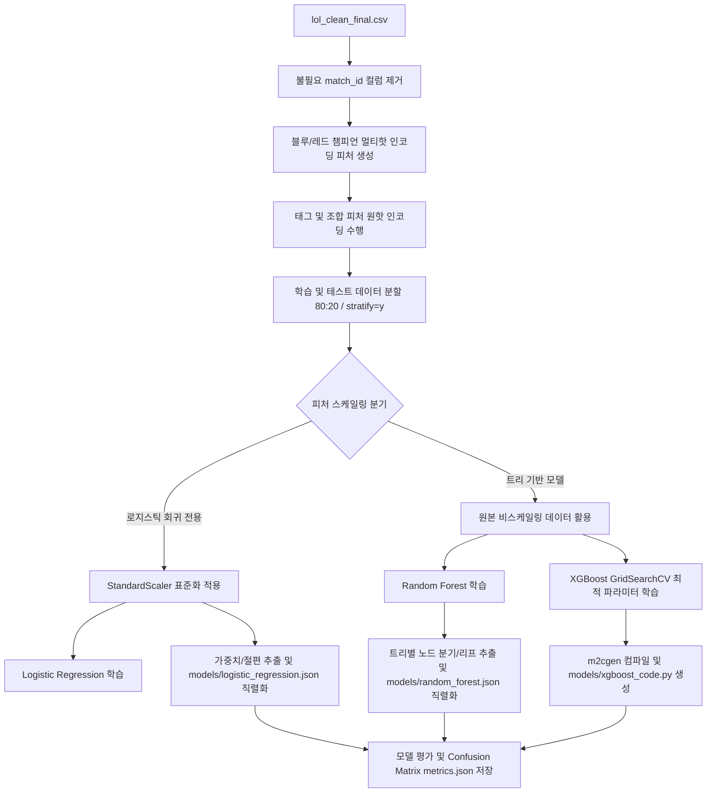

# 💎 LoL Early WinRate Predictor (10m)
## 리그 오브 레전드 다이아몬드+ 랭크 10분 지표 기반 실시간 승률 예측 솔루션

<p align="center">
  
</p>

<p align="center">
  <strong>HEXTECH Predictive Engine Team</strong><br>
  Advanced Analytics for Competitive LoL Play
</p>

---

## 📌 목차
<details>
  <summary>클릭하여 목차 열기/닫기</summary>
  
  - [✨ 주요 기능](#-주요-기능)
  - [🤖 머신러닝 파이프라인 구성 요약](#-머신러닝-파이프라인-구성-요약)
  - [🛠 기술 스택 및 선정 이유](#-기술-스택-및-선정-이유)
  - [🏗 아키텍처 및 폴더 구조 (상세)](#-아키텍처-및-폴더-구조-상세)
  - [🤝 협업 및 자동화 규칙](#-협업-및-자동화-규칙)
  - [📈 데이터 전처리 및 모델 학습 파이프라인](#-데이터-전처리-및-모델-학습-파이프라인)
</details>

---

## ✨ 주요 기능
<details open>
  <summary><b>1. Hextech UI/UX 대시보드 및 마커 핀 반응형 팝오버</b></summary>
  소환사의 협곡 지도 위에 블루팀/레드팀이 완벽한 대각선 비주얼 대칭을 이루는 8개의 라인 마커 핀을 배치했습니다. 마커에 커서를 가까이 대면(Hover) 상세 지표 조작 창(KDA, CS, 골드 슬라이더)이 부드럽게 팝오버 형태로 띄워져 화면 가독성을 극대화한 프리미엄 인터페이스를 제공합니다.
</details>
<details open>
  <summary><b>2. 브라우저 로컬 머신러닝 실시간 추론 엔진</b></summary>
  로지스틱 회귀 가중치와 랜덤 포레스트 의사결정 경로를 JavaScript 데이터셋 구조로 포팅하고, XGBoost 모델은 m2cgen 컴파일러로 자바스크립트 수식화하여 브라우저 로컬에서 서버 대기 없이 즉각적으로 승률 예측 연동을 수행합니다.
</details>
<details open>
  <summary><b>3. 데이터 기반 인사이트: 드래곤 골드 가치 환산</b></summary>
  로지스틱 회귀 모델의 비표준화 계수 비율을 실시간 편미분 분석하여 <b>"드래곤 1마리 ≒ 1,500 내외 골드"</b>의 격차와 동일한 Odds 상승 효과를 가짐을 수치화해 전략적 인사이트를 제공합니다.
</details>
<details open>
  <summary><b>4. 인터랙티브 시각화 차트</b></summary>
  Chart.js를 활용하여 각 모델의 <b>혼동 행렬(Confusion Matrix) TP/TN/FP/FN</b>, 모델별 중요 피처 분포 및 양수/음수 계수 그래프를 다이내믹하게 렌더링합니다.
</details>
<details open>
  <summary><b>5. 챔피언 밴픽 조합 시너지 & 카운터 연동</b></summary>
  "자야-라칸", "코그모-룰루" 등의 특수 라인 시너지와 "사일러스 ➔ 말파이트", "카사딘 ➔ 베이가" 등 한글화된 탑/정글/미드/바텀/서폿 포지션별 카운터 픽 상성을 실시간 리포트로 시각화합니다.
</details>

---

## 🤖 머신러닝 파이프라인 구성 요약

프로젝트의 예측 정확도 향상과 수학적 해석 가능성을 동시에 달성하기 위해 3단계 모델 구조를 운용합니다.

| 구분 | 모델 | 역할 | 주요 분석 요소 | 주요 성능 지표 (Test ACC) |
| :--- | :--- | :--- | :--- | :--- |
| **베이스라인** | **Logistic Regression** | 성능 기준점 + 피처별 계수 해석 | 드래곤 가치를 골드로 직접 환산 (1 Dragon ≈ 1,500 Gold) | **79.2%** |
| **비교** | **Random Forest** | 중간 비교 기준 (의사결정 앙상블) | 비선형 관계 학습 및 중요도 비교 대조 | **78.2%** |
| **최적화** | **XGBoost** | 최고 성능 달성 (GridSearchCV 최적 튜닝) | 부스팅 피처 기여도 분석 및 최강 성능 입증 | **77.8%** |

---

## 🛠 기술 스택 및 선정 이유

### Frontend / Client-side ML
<p>
  
  
  
  
</p>

* **React & Vite**: 빠르고 유연한 컴포넌트 렌더링 및 초고속 빌드 성능을 통한 최상의 핫 리로딩(HMR) 환경 제공
* **Tailwind CSS**: 마법공학 테마의 다크 모드, 네온 섀도우 효과 및 미려한 글래스모피즘(Glassmorphism) 스타일을 구현하기 위한 다목적 스타일링 프레임워크
* **Client-side ML (JS)**: 파이썬 모델 정보를 JS 코드로 최적 이식하여 백엔드 서버 없이 브라우저 단독으로 완전하고 보안성 높은 초고속 정적 배포 지원

### Python ML 파이프라인 (학습 전용)
<p>
  
  
</p>

* **Scikit-learn**: 데이터 표준화(StandardScaler), 로지스틱 회귀, 랜덤 포레스트 학습 및 가중치 추출용
* **XGBoost**: 정형 데이터셋에서 최고 수준의 일반화 성능을 입증하는 앙상블 모델로 프로젝트 최적 성능 달성

---

## 🏗 아키텍처 및 폴더 구조 (상세)

각 폴더와 파일의 역할을 토글로 구성하여 한눈에 파악할 수 있도록 작성되었습니다.

<details>
  <summary>📂 <b>전체 디렉터리 트리 보기</b></summary>

```text
.
├── 📁 models/                  # 학습 완료된 모델 파라미터 및 평가지표 저장소
│   ├── 📄 feature_names.json   # 예측 시 사용되는 피처의 순서 정보
│   ├── 📄 logistic_regression.json  # 로지스틱 회귀 학습 완료 가중치 및 절편 JSON
│   ├── 📄 random_forest.json   # 랜덤 포레스트 컴팩트 트리 구조 JSON
│   ├── 📄 xgboost_code.js      # XGBoost m2cgen 컴파일 JavaScript 코드 (추론용)
│   ├── 📄 scaler.json          # 스케일링 평균/분산 정보의 JSON 버전
│   ├── 📄 metrics.json         # 각 모델의 성능 평가지표 (Accuracy, ROC-AUC 등)
│   └── 📄 champion_ml_win_rates.json # 알고리즘별 챔피언 기여도 기반 동적 승률 데이터
├── 📁 src/                     # React 소스코드 디렉터리
│   ├── 📁 utils/               # 로컬 추론 및 시너지 계산용 JS 연산 유틸
│   │   ├── 📄 lolEngine.js     # 한국어 챔피언 매핑, 시너지 및 카운터 계산 로직
│   │   └── 📄 predictEngine.js # JS 포팅된 3대 머신러닝 로컬 추론 코어 코드
│   ├── 📄 App.jsx              # 전체 마법공학 UI, 마커 핀 호버 인터랙션이 포함된 메인 컴포넌트
│   ├── 📄 main.jsx             # React 마운트 엔트리 포인트
│   └── 📄 index.css            # 글로벌 테마 스타일링 및 애니메이션 정의
├── 📄 index.html               # Vite SPA 렌더링 템플릿
├── 📄 package.json             # 노드 의존성 및 빌드 스크립트 설정
├── 📄 tailwind.config.js       # 테마 컬러(gold-main, blue-team, red-team 등) 설정 파일
├── 📄 vite.config.js           # Vite 번들러 세부 설정
├── 📄 vercel.json              # Vercel SPA 라우팅 및 정적 호스팅 설정
├── 📄 lol_clean_final.csv      # 모델 학습 원천 데이터셋 (공허 유충 지표 포함)
├── 📄 train.py                 # 전처리 및 모델 학습 파이프라인의 메인 실행 스크립트
└── 📄 README.md                # 전체 프로젝트 소개 및 가이드 문서 (본 문서)
```
</details>

### 주요 파일 역할 세부 설명

* **`src/App.jsx`**: 애플리케이션의 컨트롤 타워입니다. 소환사의 협곡 맵 내부에 X-Y 스왑 대칭이 적용된 8개 라인 마커 핀을 렌더링하고, 호버 및 250ms의 넉넉한 디바운스 이탈 타이머로 구동되는 다이내믹 플로팅 설정 카드를 통합 관리합니다.
* **`src/utils/predictEngine.js`**: JS 포팅 로직의 집약체입니다. 로지스틱 가중치 및 랜덤 포레스트 컴팩트 결정을 로컬 루프로 연산하며, 바인딩된 `xgboost_code.js` 함수를 호출하여 브라우저 로컬 환경 내 무의존성 예측을 가능케 합니다.
* **`train.py`**: 파이썬 환경의 학습 스크립트입니다. 전처리를 통해 도출된 가중치와 노드 분기점 파라미터를 프론트엔드용 JSON 및 JS로 직렬화하여 추출합니다.

---

## 🤝 협업 및 자동화 규칙

* **Git Flow 전략**: `main` 브랜치 직접 커밋을 금지하며, 개발 작업은 `BE-전기헌-이슈번호` 등의 피처 브랜치에서 진행 및 검증 후 머지
* **Commit Convention**: 이모지와 태그 결합 컨벤션 준수 (`✨ Feat`, `💄 Design`, `♻️ Refactor` 등)
* **정적 최적화**: Vercel을 통한 SPA 호스팅 빌드를 적극 권장하며, 배포 전 `npm run build` 정합성 및 린트 검증 필수 수행

---

## 📈 데이터 전처리 및 모델 학습 파이프라인

정교한 분석과 신뢰도 높은 평가를 위해 `train.py` 파이프라인에 최신 머신러닝 베스트 프랙티스를 적용했습니다.



<details open>
  <summary><b>🔥 데이터 전처리 핵심 포인트</b></summary>
  
  1. **챔피언 멀티핫 인코딩**: 5개 라인별로 기입된 챔피언 이름을 양 팀 각각에 대해 160+개 챔피언 전체의 존재 여부(1.0 또는 0.0)로 매핑하는 멀티핫 인코딩을 적용해 모델이 챔피언 개별 특성과 승률 기여도를 효과적으로 포착할 수 있게 구성했습니다.
  2. **공허 유충 및 전령 지표 반영**: CSV 데이터셋 단계에서부터 `blue_voidgrubs`/`red_voidgrubs` 정보가 존재하며, 모델 피처에 정식 편입되어 드래곤 가치 환산과 함께 경기 예측의 주요 지표로 활용됩니다.
</details>
