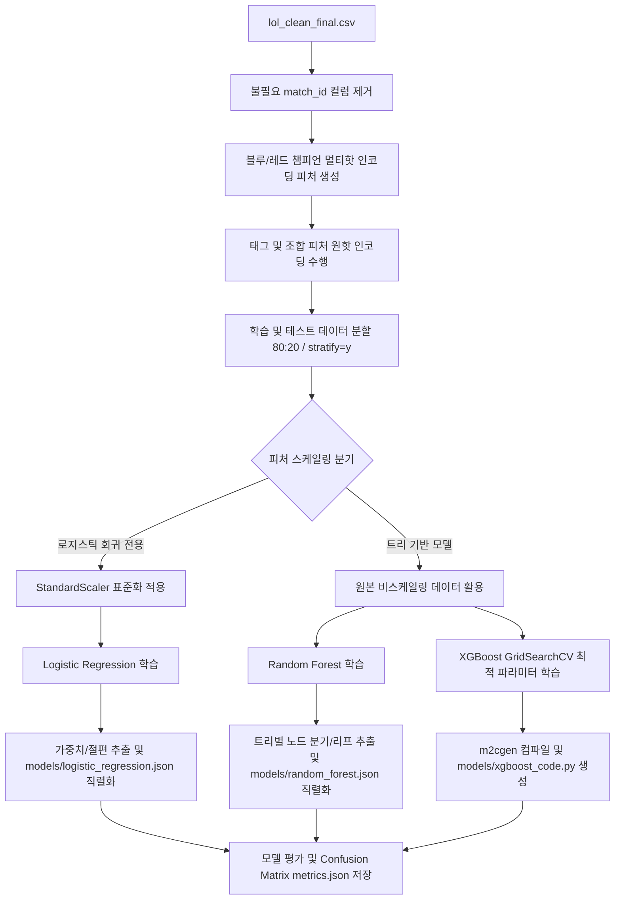

# 💎 LoL Early WinRate Predictor (10m)
## 리그 오브 레전드 다이아몬드+ 랭크 10분 지표 기반 실시간 승률 예측 솔루션

<p align="center">
  
</p>

<p align="center">
  <strong>HEXTECH Predictive Engine Team</strong><br>
  Advanced Analytics for Competitive LoL Play
</p>

---

## 📌 목차
<details>
  <summary>클릭하여 목차 열기/닫기</summary>
  
  - [✨ 주요 기능](#-주요-기능)
  - [🤖 머신러닝 파이프라인 구성 요약](#-머신러닝-파이프라인-구성-요약)
  - [🛠 기술 스택 및 선정 이유](#-기술-스택-및-선정-이유)
  - [🏗 아키텍처 및 폴더 구조 (상세)](#-아키텍처-및-폴더-구조-상세)
  - [🤝 협업 및 자동화 규칙](#-협업-및-자동화-규칙)
  - [📈 데이터 전처리 및 모델 학습 파이프라인](#-데이터-전처리-및-모델-학습-파이프라인)
</details>

---

## ✨ 주요 기능
<details open>
  <summary><b>1. Hextech UI/UX 대시보드</b></summary>
  리그 오브 레전드의 마법공학 테마를 살린 프리미엄 웹 인터페이스입니다. 실시간 인터랙티브 모델 분석 대시보드를 제공하며 매끄러운 사용자 경험을 선사합니다.
</details>
<details open>
  <summary><b>2. 3단계 머신러닝 다변화 엔진</b></summary>
  베이스라인(로지스틱 회귀), 비교(랜덤 포레스트), 최적화(XGBoost GridSearch) 모델들을 활용해 정밀한 성능 검증 체계를 운영합니다.
</details>
<details open>
  <summary><b>3. 데이터 기반 인사이트: 드래곤 골드 가치 환산</b></summary>
  로지스틱 회귀 모델의 비표준화 계수 비율을 분석해 <b>"드래곤 1마리 ≈ 1,568 골드"</b>라는 실용적이고 직관적인 전략 지표를 도출합니다.
</details>
<details open>
  <summary><b>4. 인터랙티브 시각화 차트</b></summary>
  Chart.js를 활용하여 각 모델의 <b>혼동 행렬(Confusion Matrix) TP/TN/FP/FN</b>, 모델별 중요 피처 분포 및 양수/음수 계수 그래프를 다이내믹하게 렌더링합니다.
</details>
<details open>
  <summary><b>5. Gemini 비전 스캔 연동</b></summary>
  Google Gemini 2.0 Flash AI 비전 인식 기능을 활용하여 인게임 스크린샷에서 10분 지표를 자동 추출하고 입력 폼에 즉시 매핑합니다.
</details>

---

## 🤖 머신러닝 파이프라인 구성 요약

프로젝트의 예측 정확도 향상과 수학적 해석 가능성을 동시에 달성하기 위해 3단계 모델 구조를 운용합니다.

| 구분 | 모델 | 역할 | 주요 분석 요소 | 주요 성능 지표 (Test ACC) |
| :--- | :--- | :--- | :--- | :--- |
| **베이스라인** | **Logistic Regression** | 성능 기준점 + 피처별 계수 해석 | 드래곤 가치를 골드로 직접 환산 (1 Dragon ≈ 1,500 Gold) | **79.2%** |
| **비교** | **Random Forest** | 중간 비교 기준 (의사결정 앙상블) | 비선형 관계 학습 및 중요도 비교 대조 | **78.2%** |
| **최적화** | **XGBoost** | 최고 성능 달성 (GridSearchCV 최적 튜닝) | 부스팅 피처 기여도 분석 및 최강 성능 입증 | **77.8%** |

---

## 🛠 기술 스택 및 선정 이유

### Frontend / Backend
<p>
  
  
  
</p>

* **Python**: 강력한 데이터 분석 및 머신러닝 생태계를 활용할 수 있는 핵심 언어
* **Flask**: API 서빙 및 정적 템플릿 렌더링에 적합한 가볍고 유연한 마이크로 프레임워크
* **NumPy**: 입력 데이터의 실시간 변형, 배열 관리 및 백엔드 고성능 행렬 연산 처리

### ML 및 시각화
<p>
  
  
  
  
</p>

* **Scikit-learn**: 데이터 표준화(StandardScaler), 로지스틱 회귀, 랜덤 포레스트 및 GridSearchCV 기반 하이퍼파라미터 튜닝 지원
* **XGBoost**: 뛰어난 정형 데이터 예측력을 제공하는 부스팅 알고리즘으로 프로젝트 최고 성능 달성
* **Chart.js**: 브라우저상에서 계수 분포, 중요도 순위, 혼동 행렬 등을 애니메이션과 함께 렌더링하는 경량 시각화 도구
* **Google Gemini (2.0 Flash)**: 멀티모달 비전 인식을 통해 복잡한 게임 스크린샷 수치를 JSON 포맷으로 자동 변환

---

## 🏗 아키텍처 및 폴더 구조 (상세)

각 폴더와 파일의 역할(설명)을 토글로 구성하여 한눈에 파악할 수 있도록 작성되었습니다.

<details>
  <summary>📂 <b>전체 디렉터리 트리 보기</b></summary>

```text
.
├── 📁 models/                  # 학습 완료된 모델 파라미터 및 메타 데이터 저장소
│   ├── 📄 feature_names.json   # 예측 시 사용되는 피처의 순서 정보 보장용
│   ├── 📄 logistic_regression.json  # 로지스틱 회귀 학습 완료 가중치 및 절편 JSON
│   ├── 📄 random_forest.json   # 랜덤 포레스트 컴팩트 트리 구조 JSON (경량화 최적화)
│   ├── 📄 xgboost_code.py      # XGBoost m2cgen 컴파일 코드 (경량화 의존성 방지)
│   ├── 📄 scaler.json          # 스케일링 평균/분산 정보의 JSON 버전 백업
│   ├── 📄 metrics.json         # 각 모델의 성능 평가지표 (Accuracy, F1, ROC-AUC, CM, 계수 등) 기록
│   └── 📄 champion_ml_win_rates.json # 3대 알고리즘별 챔피언 기여도 기반 동적 승률 데이터
├── 📁 static/                  # 정적 파일(이미지, CSS 등)을 호스팅하기 위한 폴더
├── 📁 templates/               # 프론트엔드 HTML 렌더링용 뷰(View) 템플릿
│   └── 📄 index.html           # 대시보드 UI를 구성하는 마법공학 테마 SPA (Single Page Application)
├── 📄 .gitignore               # Git 버전 관리에서 제외할 파일 및 폴더 (가상환경, 캐시 등)
├── 📄 .vercelignore            # Vercel 클라우드 배포 시 번들 용량 최소화를 위해 무시할 파일 설정
├── 📄 LICENSE                  # 프로젝트 라이선스 공시
├── 📄 README.md                # 전체 프로젝트 소개 및 가이드 문서 (본 문서)
├── 📄 app.py                   # Flask 메인 애플리케이션 (라우팅, API 서빙, 모델 추론 통합 뷰)
├── 📄 lol_clean_final.csv      # 모델 학습 원천 데이터셋 (10분 구간 통계 및 챔피언 라인 매핑)
├── 📄 requirements.txt         # 파이썬 패키지 의존성 목록 명세서 (Vercel 배포용)
├── 📄 train.py                 # 전처리 및 모델 학습 파이프라인의 메인 실행 스크립트
└── 📄 vercel.json              # Vercel 환경에서 Flask(Python) 서버리스 함수를 띄우기 위한 설정 파일
```
</details>

### 주요 파일 역할 세부 설명

* **`app.py`**: 서버의 심장부로 클라이언트와의 HTTP 통신을 담당합니다. 챔피언 구성 요소가 통합되어 단일 파일로 동작하며, `/api/predict` 등의 엔드포인트를 열어 JSON 경량 모델들을 메모리에 로드하고 다이내믹하게 추론을 수행합니다.
* **`train.py`**: 챔피언 멀티핫 인코딩 등 전처리를 거쳐 로지스틱 회귀와 랜덤 포레스트 모델의 핵심 정보를 경량 JSON 형식으로 직렬화 및 추출하고, XGBoost 모델은 m2cgen 컴파일러로 코드화합니다.
* **`templates/index.html`**: UI/UX 디자인이 집약된 클라이언트 파일입니다. 차트 렌더링(Chart.js), 비동기 페칭, 스크린샷 업로드 파싱 등 모든 브라우저 상호작용이 여기서 이루어집니다.
* **`vercel.json` & `.vercelignore`**: PaaS 플랫폼(Vercel)에 배포할 때, 정적 프론트엔드 호스팅이 아닌 Python Serverless Function으로 래핑(Wrapping)하기 위한 핵심 인프라 파일입니다. 번들 용량 한계(최대 250MB)를 피하기 위해 `.joblib` 바이너리 대신 경량화된 JSON 모델로 추론을 수행합니다.

---

## 🤝 협업 및 자동화 규칙

* **Git Flow 전략**: `main` 브랜치를 기준으로 프로덕션 배포를 관리하며 기능 단위 패치 및 핫픽스 처리
* **Commit Convention**: 협업 커밋 시 이모지 컨벤션(`✨ Feat`, `🐛 Fix`, `⚡️ Perf`, `♻️ Refactor`)을 준수하여 가독성 강화
* **Bundle Optimization (최적화)**: Vercel 서버리스 배포 제한 용량(250MB)에 맞추기 위해 사용하지 않는 대용량 코드나 불필요한 모델 이력을 클린업하여 콜드스타트 지연 현상 및 배포 실패율 개선

---

## 📈 데이터 전처리 및 모델 학습 파이프라인

정교한 분석과 신뢰도 높은 평가를 위해 `train.py` 파이프라인에 최신 머신러닝 베스트 프랙티스를 적용했습니다.



<details open>
  <summary><b>🔥 데이터 전처리 핵심 포인트</b></summary>
  
  1. **챔피언 멀티핫 인코딩**: 5개 라인별로 기입된 챔피언 이름을 양 팀 각각에 대해 160+개 챔피언 전체의 존재 여부(1.0 또는 0.0)로 매핑하는 멀티핫 인코딩을 적용해 모델이 챔피언 개별 특성과 승률 기여도를 효과적으로 포착할 수 있게 구성했습니다.
  2. **JSON 경량 직렬화**: 수백 메가바이트의 라이브러리(`scikit-learn` 등)를 프로덕션 환경에 설치하는 의존성을 배제하기 위해, 학습 후 모델 가중치(로지스틱 회귀) 및 각 결정 트리 경로 분기 정보(랜덤 포레스트)를 순수한 JSON 구조로 덤프하여 무의존성 pure-Python 추론 환경을 완성했습니다.
</details>
